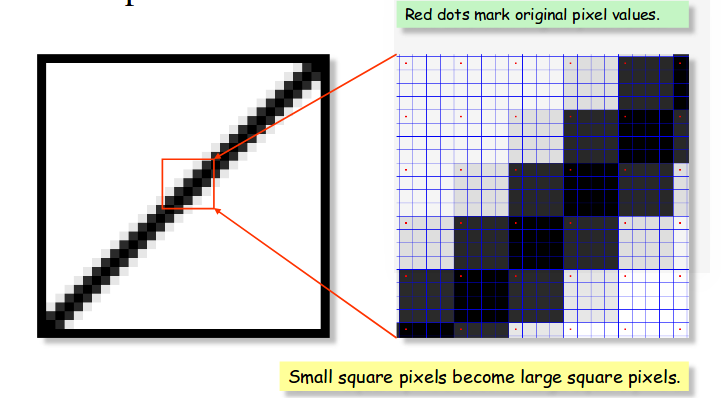
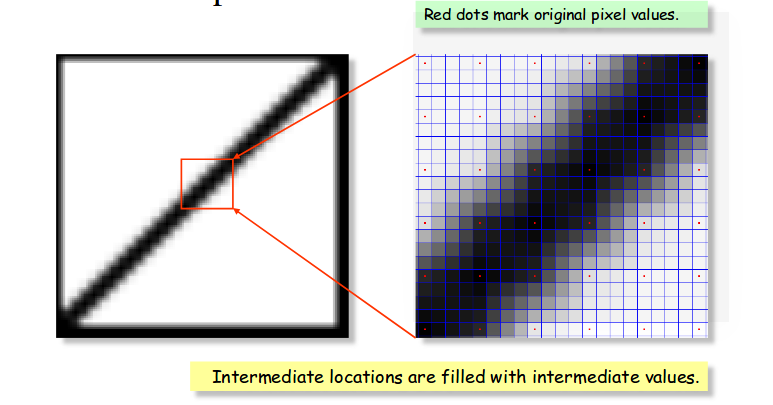
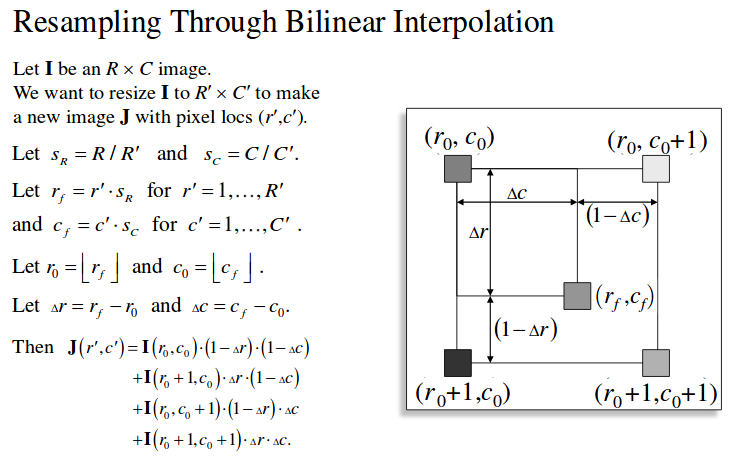

## Problem 1

In this problem, we need to implement Resizing using interpolation.

### Nearest Neighbor Interpolation

The “Nearest Neighbor” algorithm is a generalization of pixel replication and decimation.  



### Bilinear Interpolation

In "Bilinear Interpolation" we fill the Intermediate locations with intermediate values.



I have refered  to [Richard Alan Peters' II digital image processing slides on interpolation](https://archive.org/download/Lectures_on_Image_Processing/EECE_4353_15_Resampling.pdf), specifically slide #59 and also [this for idea of implementation](https://stackoverflow.com/questions/26142288/resize-an-image-with-bilinear-interpolation-without-imresize)

-  

  This is the code segment to enlarge the image by 2X.

  ```matlab
  f3 = imread('img1.jpg');
  figure; imshow(f3);
  nearestNeighbour(f3, [5,5])
  pause(3);
  bilinearInterpolation(f3, [5,5])
  pause(3);
  ```


 ### Original Image (Onion.jpg)


#### Resizing using Nearest Neighbour (2x)


#### Resizing using Bilinear Interpolation (2x)


#### Resizing using Nearest Neighbour (5x)


#### Resizing using Bilinear Interpolation (5x)


### Conclusion

If we compare the output of both the functions. The Image with **Bilinear Interpolation** is better. 

In **Nearest neighbour interpolation** algorithm value of the output cell is determined by the nearest cell center  on the input grid. The algorithm is the most simple and fast algorithm.  Nearest Neighbor is best used for categorical data like land-use classification or slope classification. It has the advantages of fast speed, but it can bring significant distortion.

**Bilinear Interpolation** uses a weighted average of the four nearest cell centers. The closer an input cell center is to the output cell center,  the higher the influence of its value is on the output cell value. This means that the output value could be different than the nearest input, 
but is always within the same range of values as the input.

Bilinear interpolation method is more complex than the nearest neighbour method, and so it has larger calculation. It has no gray discontinuity defects and has satisfactory results.

**Bicubic Interpolation** looks at the 16 nearest cell centers to the output and  fits a smooth curve through the points to find the value. This method is also not recommended for categorical data, but does an excellent job of smoothing continuous data.