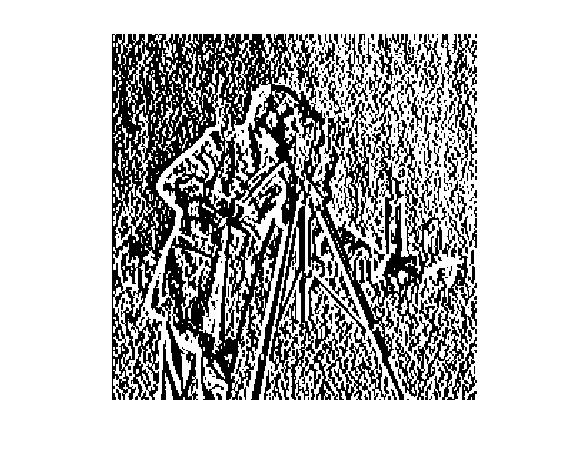
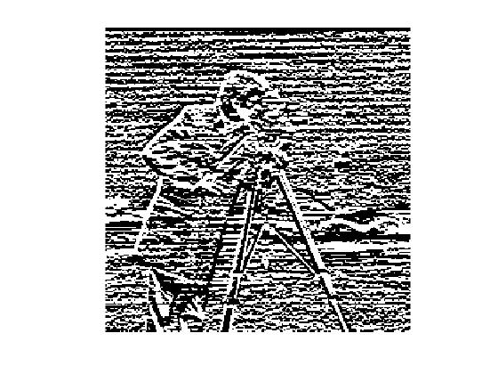

## Problem 2

### Source Code 

```matlab
M = [-1,-2,-1;0,0,0;1,2,1];
Mt= transpose(M);
cam = double(imread('cameraman.tif'));
cl = conv2(cam,M,'same'); 
cl2 = conv2(cam,Mt,'same');
```

### Input Image


### Observation

| On convulation with Sobel Filter | On convulation with Sobel Filter Transpose |
| :------------------------------- | ---------------------------------------- |
|           |                   |

### Conclusion

Hence we can see that this filter is a gradient detecting filter which represents the image gradient. This filter will detect the horizontal gradient i.e vertical edges and the transpose will detect the vertical gradient i.e it detects horizontal edges.