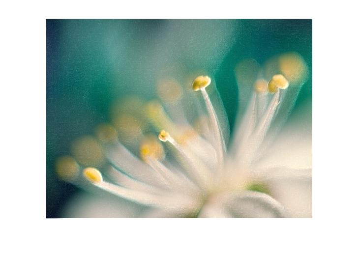

##Problem 5

Filter to obtain sample_out.png from sample_inp.png

| sample_inp.png                | sample_out.png                |
| ----------------------------- | ----------------------------- |
|  |  |

We will use edge detection filter, i.e Sobel filter as in the output figure we can see that a white line appeared when the colour changed from black to white.

Let's do operation on few images,  first applying filter, then apply filter transpose and at the end all three.

### Blur.jpg

**Original Image**

| Convolve blur.jpg with Matrix | Convolve blur.jpg with Matrix Transpose |
| ----------------------------- | --------------------------------------- |
|    |    |

**Final Image** (formed after adding all the 3)

We will use edge detection filter, i.e Sobel filter as in the output figure we can see that a white line appeared when the colour changed from black to white.`

### Onion.png

| Convolve onion.png with Matrix | Convolve onion.png with Matrix Transpose |
| ------------------------------ | ---------------------------------------- |
|    |    |

**Final Image** (formed after adding all the 3)

