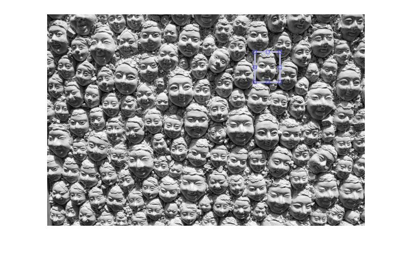

## Problem 6

In this problem we used the concept of normal correlation, because the normal correlation value is max for two similar images. I have implement `normxcorr2` in built function.

Faces.jpg			               										

F1.jpg			 	 		

```matlab
  F1 = im2double(rgb2gray(imread('F1.jpg')));
  Faces = im2double(rgb2gray(imread('Faces.jpg')));
  c = normalize_convulation(Faces,F1);
```

We make the matrix normalized convulation matrix. Then we use the fact that where normal correlation value is max , that point where two similar images.

