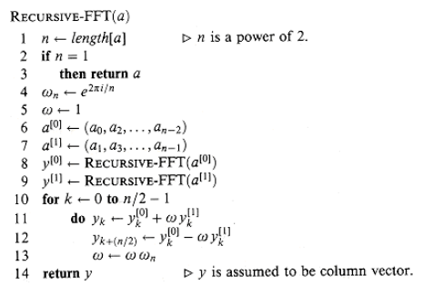
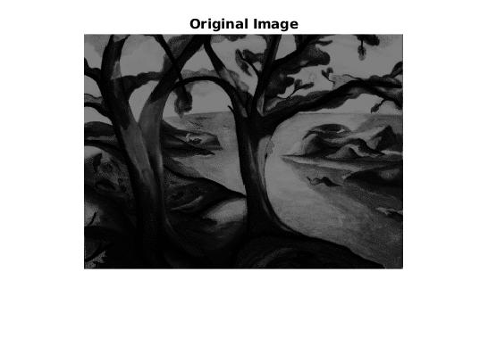
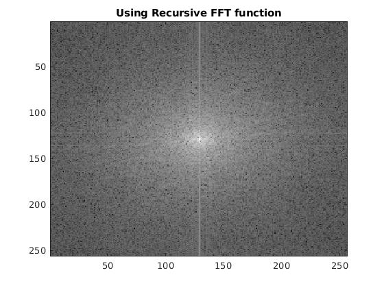
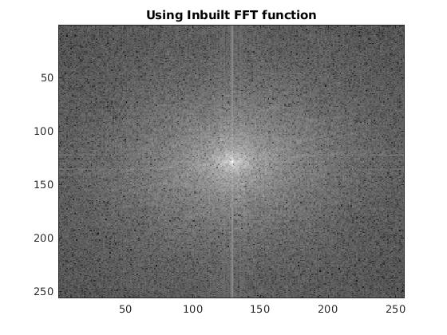
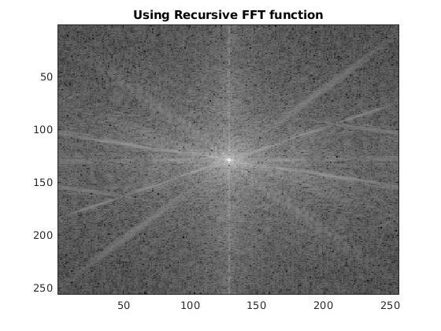
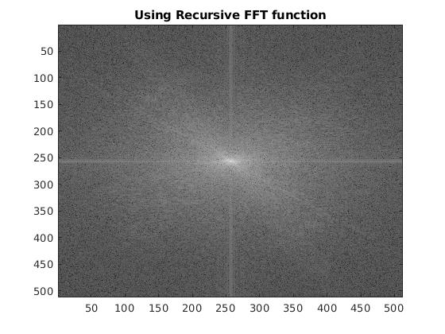
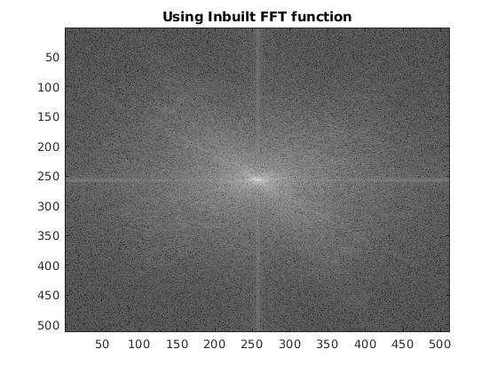

## Problem 1

In this problem, we need to write a matlab function to compute 2D Fast Fourier Transform (Recursive Formulation).

### Approach

- To compute 2D FFT we need to 

  - do 1D FFT on each row (real to complex) . . . .. . . (1)
  - do 1D FFT on each column resulting from (1) (complex to complex)

- So, we need to write code 1D FFT. I used this algorithm to write code for 1D FFT.

  

### Code

1. 2D FFT code which uses 1D FFT.

    ```matlab
    FFT_row = zeros(size(A));
    FFT_col = zeros(size(A));

    %Perform FFT on each row
    for i=1:size(A,1)
        FFT_row(i,:) = recursive_FFT(A(i,:));
    end

    %Perform FFT on each column
    for i=1:size(A,2)
        FFT_col(:,i) = recursive_FFT(FFT_row(:,i).');
    end

    % Plot the 2D FFT
    C = fftshift(FFT_col);
    figure, imagesc(mat2gray(log(abs(C)+1))), colormap gray;
    title('Using Recursive FFT function');
    ```

2. Recursive 1D FFT.

   ```matlab
   function FFT = recursive_FFT(x)
   % Only works if N = 2^k
   N = length(x); 
   even_part = zeros(1,floor(N/2));
   odd_part = zeros(1,floor((N+1)/2));
   for i=1:2:N
       odd_part(1,floor((i+1)/2))=x(1,i);
   end
   for i=2:2:N
       even_part(1,floor(i/2))=x(1,i);
   end
   if N == 1
       FFT = x;
   else
       ODD_FFT = recursive_FFT(odd_part);
       EVEN_FFT = recursive_FFT(even_part);
       FFT = zeros(N,1);
       Exp_vec = exp(-1i*2*pi*((0:N/2-1)')/N);
       tmp = Exp_vec .* EVEN_FFT;
       FFT = [(ODD_FFT + tmp);(ODD_FFT -tmp)];
   end
   ```
   
3. 2D FFT using inbuilt function `fft2`.

    ```matlab
    B = fftshift(fft2(A));
    figure, imagesc(mat2gray(log(abs(B)+1))), colormap gray;
    title('Using Inbuilt FFT function');
    ```

### Img1.jpg

| My Recursive FFT function | Inbuilt FFT2 function |
| ---- | ---- |
|      |  |

### Img2.jpg

| My Recursive FFT function | Inbuilt FFT2 function |
| ---- | ---- |
|      |  |

### Img3.jpg

| My Recursive FFT function | Inbuilt FFT2 function |
| ---- | ---- |
|      |  |

### Observation

As we can see the output results of both inbuilt 2D FFT function (`fft2`) and my recursive 2D FFT function are almost identical. My spectrogram works only if the input image is some power of 2.
