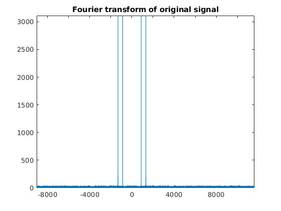
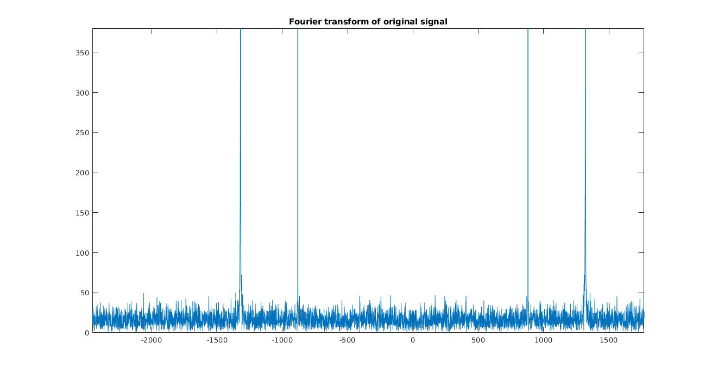
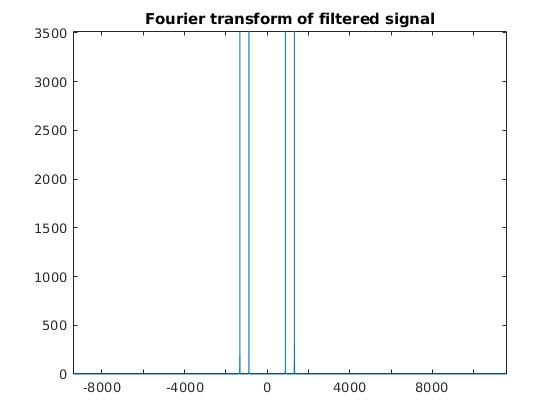

## Problem 2

In this problem, you are given a file **q2.mat** with signal X and the sampling frequency, **Fs**. The signal consists of the sound played by a particular key of a two tone telephone. Your task is to find out the frequencies of this particular key, and clean the noisy signal as best as you can.

### Approach

- First we load **q2.mat** and find out the **signal X** and **frequency Fs**.
- Then we convert the signal to frequency domain using `fft` and `fftshift` functions.
- We find out the frequencies present in the dial tone of that key by plotting graph of FFT.
- Then we made a band pass filter whose value is 1 never the peaks of FFT and is 0 elsewhere.
- We mutiply the original signal by our filter, to get denoised signal, the converted the signal back to time domain using `ifft` and `ifftshift` functions.

### Code

1. Finding the input signal, converting to frequency domain and plotting the FFT.

    ```matlab
    % Getting X, Fs
    aud = load('q2.mat');
    X = aud.X;
    Fs = aud.Fs;

    % Doing Fourier Transform
    Y = fftshift(fft(X));
    l = length(Y);
    P1 = abs(Y);
    f =  (-l/2:l/2 -1);
    figure;
    plot(f,P1);
    title('Fourier transform of original signal');
    ```
    
    In the above figure ,we can clearly see the noise in the input signal.
    

    From the above figure, we can get the frequencies of this particular key, 

2. Applying the filter

   ```matlab
   % Figure out the X values for filtering from the plot
   f1 = 885;
   f2 = 1325;
   r = 10;

   % Making band pass filter
   rectangle = zeros(l,1);
   rectangle(l/2 + f1 -r:l/2 + f1 +r) = 1;
   rectangle(l/2 + f2 -r:l/2 + f2 +r) = 1;
   rectangle(l/2 - f1 -r:l/2 - f1 +r) = 1;
   rectangle(l/2 - f2 -r:l/2 - f2 +r) = 1;

   % Multiplying the fft of original signal by filter
   Y1 = Y.*rectangle;
   P2 = abs(Y1);
   figure;
   plot(f,P2);
   title('Fourier transform of filtered signal');
   ```
   
    In the above figure ,we can clearly see that there is no noise in this signal.

3. Taking inverse fourier transform to take reconstructed signal back into time domain.

   ```matlab
   % Performing Ifft of filtered signal
   y_rect = ifft(ifftshift(Y1));
   sound(y_rect,Fs);
   ```