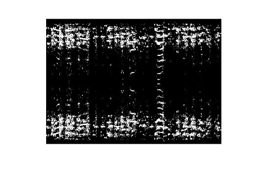
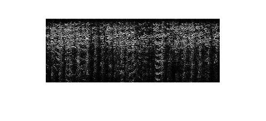
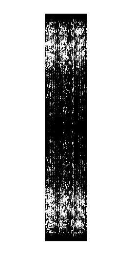
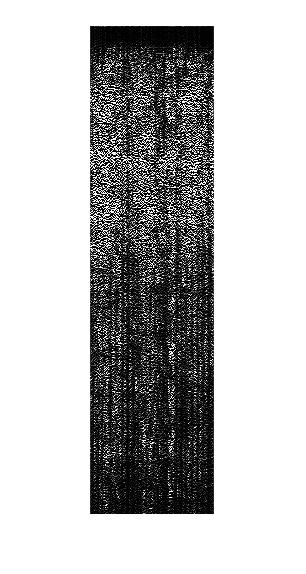
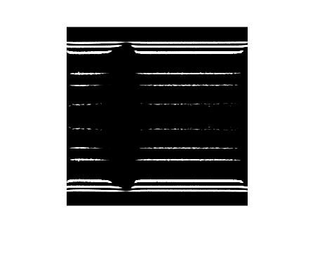
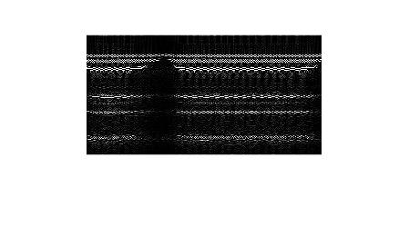
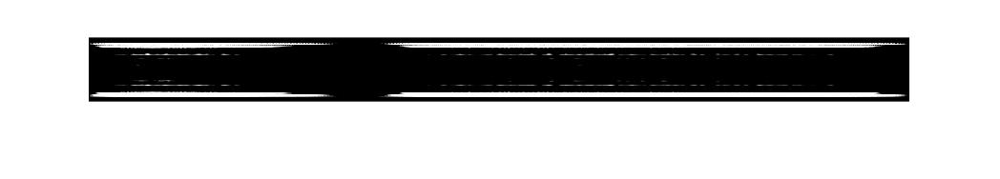
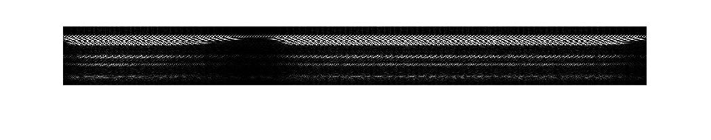

## Problem 3

In this problem, we need to write a matlab function to compute the spectrogram of a given audio file. (Use window size and the length of the stride as the input to your function.)

A **spectrogram** is a visual representation of the [Short-Time Fourier Transform](http://en.wikipedia.org/wiki/Short-time_Fourier_transform).   We take chunks of an input signal and applying a local  Fourier Transform on each chunk.  Each chunk has a specified width and we apply a Fourier Transform to this chunk. Each chunk has an associated frequency distribution.  For each chunk that is centred at a specific time point in your time signal, you get a bunch of frequency components.  The collection of all of these frequency components at each chunk and plotted all together is what is essentially a spectrogram. 

### Approach

- First we calculate the step length as window size - length of stride.
- Then we make an offset containing the start points of each step.
- Then we iterate over the array taking STFT for every window size
- Then we plot the graph of the obtained STFTs.

### Code

1. Myspectrogram code.

    ```matlab
    function S = myspectrogram(x, win_size, len_stride)
    step = win_size - len_stride;
    
    % offset array containing the start points of each step
offset = [ 1 : step : length(x)-win_size ];
    
    % Initailing the short fourier trnsform with zeros for each step
    S = zeros (length(offset),win_size);

    % Calculating the STFT for each small step
    for i=1:length(offset)
        S(i,1:win_size) = abs(fft(x(offset(i):offset(i)+win_size-1).*gausswin(win_size)));
    end
    % Plotting mySpectrogram
    figure, imshow(log(S(:,1:win_size)).');
    ```

2. Ploting the inbuild as well as my own spectrogram.

   ```matlab
   load laughter;
   A = myspectrogram(y, 250,100);
   B = spectrogram(y, 250, 100);
   figure, imshow(B);
   ```

### Laughter audio

**Case 1: - Window Size** : 250

​		**Length of Stride** : 100

| My Spectrogram function | Inbuilt Spectrogram function |
| ---- | ---- |
|      |      |


**Case 2: - Window Size :** 700

​		**Length of Stride** : 300

| My Spectrogram function | Inbuilt Spectrogram function |
| ---- | ---- |
|      |      |

### Train audio

**Case 1: - Window Size** : 250

​		**Length of Stride** : 200

| My Spectrogram function | Inbuilt Spectrogram function |
| ---- | ---- |
|      |      |


**Case 2: - Window Size :** 100

​		**Length of Stride** : 90

| My Spectrogram function | Inbuilt Spectrogram function |
| ---- | ---- |
|      |      |

### Observation

**Syntax of spectrogram(x,window,noverlap) function**

`x` - This is the input time-domain signal you wish to find the spectrogram of.  

`window` - If you recall, we decompose the image into chunks, and each chunk has a specified width.  **window** defines the width of each chunk in terms of **samples**.

`noverlap` -  **noverlap** defines how many samples are overlapped in each window.  The default is 50% of the width of each chunk.

**Window Size**

As we increase the window, we increase the width of each chunk, hence less samples are taken. **Larger the window size**, the **better frequency resolution** you get as you're capturing more of the frequencies, but the **time localization is poor**. The **smaller the window size**, the **better localization you have in time**, but you **don't get that great of a frequency **decomposition.

**Noverlap**

A proper spectrogram ensures that each chunk has a certain number of samples that are overlapping for each chunk. The more the chunks are **overlapping**, more  good frequency localization is in the spectrogram.

**Comparison between myspectrogram vs inbuilt spectrogram** 

As we can see the output results of both inbuiltspectrogram function and my spectrogram function are almost identical.