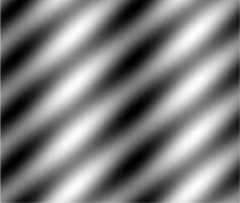

## Problem 4

In this problem, write need to write observations on doing FFT over the images Img1a.png, Img1b.png, Img2a.png, Img2b.png in the report and also write a MATLAB code to remove noise from Img3.png.

### Code

1. Calculating the fft of Image for all the three channels, i.e. red, green and blue and then concatenating them.

    ```matlab
    % Read the Image
    imageA = imread('images/Img1a.png');
    fft_red = fftshift(fft2(imageA(:,:,1)));
    fft_green = fftshift(fft2(imageA(:,:,2)));
    fft_blue = fftshift(fft2(imageA(:,:,3)));
    fftA = cat(3, fft_red, fft_green, fft_blue);
    ```

2. Used `uint8`to plot Img1a.png and Img1b.png as there were very few edges

   ```matlab
   figure, imagesc(uint8(abs(fftA))), colormap gray;
   title('Image 1A FFT2-Magnitude');
   ```
3. Used `mat2gray`to plot Img2a.png and Img2b.png as there were many edges. Also plotted logrithmic plot to view image to farther extent.

   ```matlab
   figure, imagesc(mat2gray(abs(fftC))), colormap gray;
   title('Image 2A FFT2-Magnitude');
   figure, imagesc(mat2gray(log(abs(fftC)+1))), colormap gray;
   title('Image 2A log(FFT2-Magnitude)');
   ```
### Img1A.png and Img1B.png

| Image | Corresponding FFT of the Image |
| ---------------------- | ---------------------- |
|  |  |
|  |  |

### Observations
(i) When we traverse in the horizontal direction, there is very small change in the frequency of signal as compared to the vertical direction. So the vertical stripes have more distance between them as compared to the horizontal ones.
(ii) Both Img1a.png and Img1b.png have same fft because we are applying fft shift operation after taking fft of the image.

### Img2A.png


| FFT2 Magnitude of Image2A | Log(FFT2 Magnitude) of Image2A |
| ------------------------- | ------------------------------ |
|  |    |

### Observations

(i) The input image consists of  diagonal stripes. In the Fourier transfrom we can see that the main components of the transformed image are DC value and the two points corresponding to the frequency of the stripes.
(ii) However, the logarithmic transform of the Fourier shows that now the image contains many minor frequencies. The main reason is that a diagonal can only be approximated by the square pixels of the image, hence, additional frequencies are needed to compose the image. The logarithmic scaling makes it difficult to tell the influence of single frequencies in the original image.

### Img2A.png



| FFT2 Magnitude of Image2B | Log(FFT2 Magnitude) of Image2B |
| ------------------------- | ------------------------------ |
|  |    |


### Observations
(i) This image is almost same as the previous image, but there is variation in the horizontal direction as well so we see the 2 more white dots along the horizontal direction.
(ii) the frequency components (the significant ones that contribute to the image) are accumulated in the center (because its bright as compared to the corners) and
(iii) there might be a spatial pattern associated as you can find some patterns in the center of this fft. 

### Approach to filter Noise


- First convert the original signal into frequency domain by taking fft2 and plot it.

- When we plot the image and find the white edges in the image as the original image contains the horizontal and vertical lines as part of the noise.
- We make the filter in such a way that the white edges are removed from the image, but we need to take care that the  centre part of the fft image is untouched.

- After,putting the filter, we take the Inverse Fourier transform to convert the signal back to time domain.


### Code

1. Calculating the fft of Image for all the three channels, i.e. red, green and blue using `fft2` and `fftshift`and then concatenating them, as well as plotting them.

    ```matlab
    noise_image = imread(fileName);

    % Plotting fft of the orignal image
    fft_red = fftshift(fft2(noise_image(:,:,1)));
    fft_green = fftshift(fft2(noise_image(:,:,2)));
    fft_blue = fftshift(fft2(noise_image(:,:,3)));
    fft_noise_image = cat(3, fft_red, fft_green, fft_blue);
    figure, imagesc(mat2gray(log(abs(fft_noise_image))+1)), colormap gray
    title('FFT of original Image');
    ```

2. Then we make the filter to be applied to Noised Image.
    ```matlab
    row = size(noise_image, 1);
    col = size(noise_image, 2);

    % Making filter with ones everywhere
    filter = double(ones(row,col));

    % Applying filter on rows at interval of 50
    b1 = 50;
    for i=b1:b1:row-2
        filter(i-1:i+1,:) = 0.0;
    end

    % Applying filter along columns at interval of 10
    b2 = 10;
    for i=b2:b2:col-2
        filter(:,i-1:i+1) = 0.0;
    end

    % Applying filter at the centre
    filter(:,130:132) = 1.0;
    filter(1:97,130:132) = 0.0;
    filter(103:end,130:132) = 0.0;
    filter(100,1:120) = 0.0;
    filter(100,135:end) = 0.0;
    ```

3. Apply the filter to FFT the noised Image

	```matlab
    % Plotting fft of the filtered image
    filtered_red = fft_red.*filter;
    filtered_green = fft_green.*filter;
    filtered_blue = fft_blue.*filter;
    filtered_noise_image = cat(3, filtered_red, filtered_green, filtered_blue);
    figure; imagesc(mat2gray(log(abs(filtered_noise_image)+1))) , colormap gray;
    title('FFT of filtered Image');
  ```

4. Taking the inverse fourier transform to take reconstructed signal back into time domain for all the three channels,i.e red, green and blue .

  ```matlab
  red = (abs(ifft2(ifftshift(filtered_red))));
  green = (abs(ifft2(ifftshift(filtered_green))));
  blue = (abs(ifft2(ifftshift(filtered_blue))));
  result = cat(3, uint8(red), uint8(green), uint8(blue));
  figure;
  imshow(result);
  title('Denoised Image');
  end
  ```