## Problem 6

In this problem, we need to decrypt the encrypted voice signals which have been encryted by converting them to frequency domain and divided equally into n parts and then rearrange according to a key.

### Approach

- First convert the original signal into frequency domain by taking fft.
- Then break the signal into parts
- Rearrange the parts
- Take the Inverse Fourier transform to convert the signal back to time domain.
- Hear the sound, to check if its decrypted. If not, try rearranging the signal in some other order.

To reduce the number of cases and getting to the key faster, I plotted the graph of the frequency domain of the original signal, so as to quickly reduce to only a fewer number of keys.

### Code

1. Reading the audio file and figuring out the sampling frequency and total samples.

    ```matlab
    X = audioread('message1.wav');
    p  = audioinfo('message1.wav');
    Fs = p.SampleRate;
    L = p.TotalSamples;

    % Making the time axis
    T = 1/Fs;
    t = (0:L-1)*T;

    % Plot of Original Signal in time domain
    figure;
    plot(t,X)
    title('Original Signal in Time domain')
    xlabel('t (seconds)')
    ylabel('X(t)')
    ```

2. Taking the fft and plotting the graph.

   ```matlab
   P1 = fft(X);
   % Plot of Original Signal in frequency domain

   Y1 = abs(P1);
   f = Fs*(1:(L))/L;
   figure;plot(f,Y1);
   title('Original Signal in Frequency domain')
   xlabel('f (Hz)')
   ylabel('|P1(f)|')
   ```

3. Defining domains, reconstructing the signal in frequency domain and plotting fft after rearranging the signal.

   ```matlab
   % Copying the fft of original signal
   P2 = P1;

   % Reconstructing the signal by changing fft 
   P2(domain_1) = P1(domain_3);
   P2(domain_2) = P1(domain_2);
   P2(domain_3) = P1(domain_4);
   P2(domain_4) = P1(domain_1);
   P2(domain_5) = P1(domain_8);
   P2(domain_6) = P1(domain_5);
   P2(domain_7) = P1(domain_7);
   P2(domain_8) = P1(domain_6);

   Y2 = abs(P2);
   f = Fs*(1:(L))/L;
   figure;plot(f,Y2);

   title('Reconstructed Signal in Frequency domain')
   xlabel('f(Hz)')
   ylabel('|P2(f)|')
   ```

4. Taking inverse fourier transform to take reconstructed signal back into time domain.

   ```matlab
   % Inverting the reconstructed signal back to time domain
   m = ifft(P2);
   sound(real(m),Fs);
   ```

#### Message1.wav

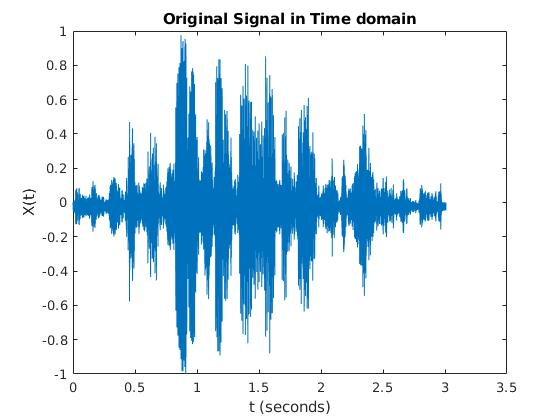
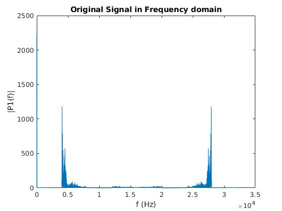
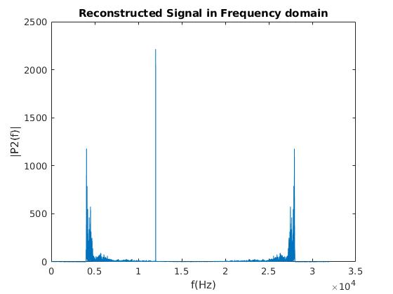
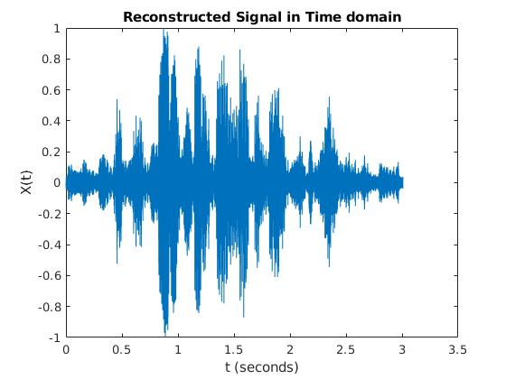

The decrypted message of message1.wav is "**If you are good at something never do it for free**". The audio output is [decrypted_message1.wav](audio/decrypted_message1.wav)

#### Message2.wav

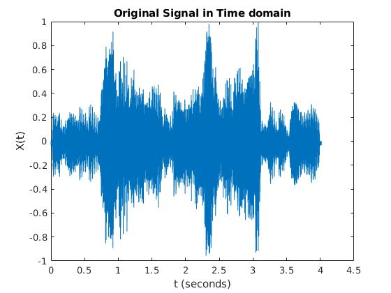
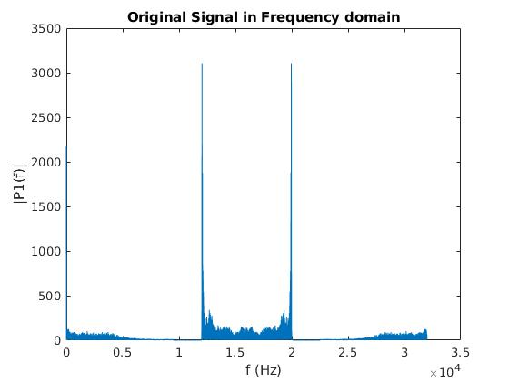
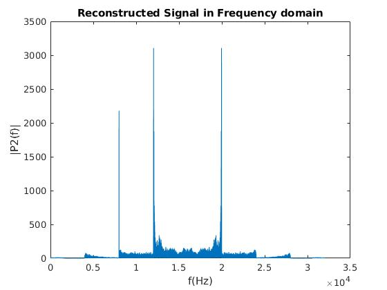
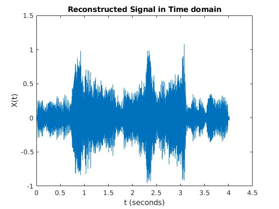

The decrypted message of message2.wav is "**Why so serious?**". The audio output is [decrypted_message2.wav](audio/decrypted_message2.wav)

#### Message3.wav

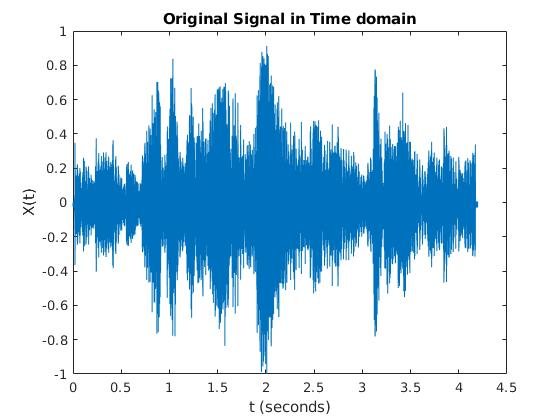
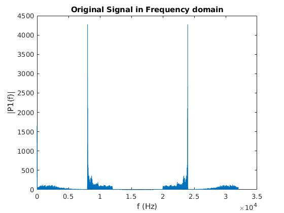
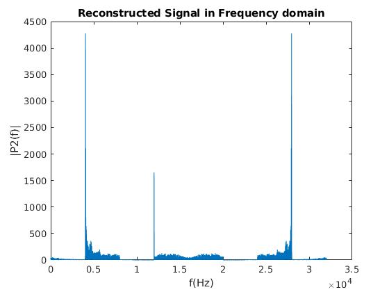
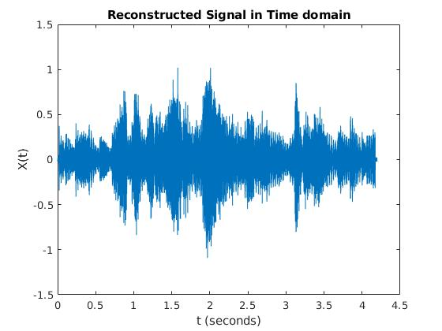

The decrypted message of message3.wav is "**Let's put a smile on that face**". The audio output is [decrypted_message3.wav](audio/decrypted_message3.wav)